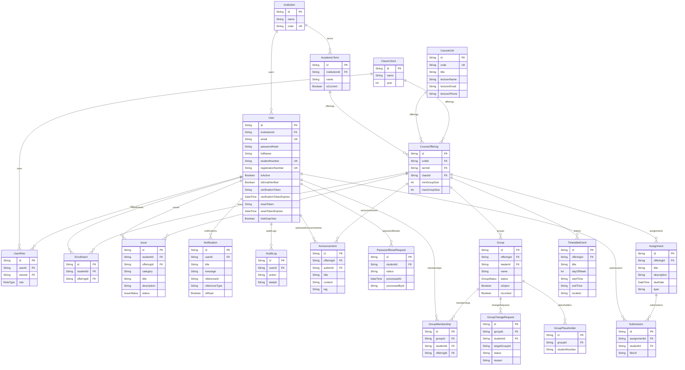

# Talora — Entity Relationship Diagram (ERD)

**Last Updated:** August 2026

This document maps out the core data model of the Talora platform as defined in the Prisma schema (`packages/database/prisma/schema.prisma`).

## Core Schema (Mermaid)

## Cascade Behaviors

- **CourseOffering Deletion:** Cascades to wipe all associated `Group`, `Enrollment`, `Assignment`, `Announcement`, `TimetableEvent`, and `Issue` records.
- **Group Deletion:** Cascades to wipe `GroupMembership`, `GroupChangeRequest`, and `GroupPlaceholder` records.
- **User Deletion:** Cascades to wipe `Enrollment`, `GroupMembership`, `UserRole`, `Submission`, `Issue`, and `Notification` records. `AuditLog` records referencing a deleted user have `userId` set to `NULL` (SetNull) to preserve historical integrity.
- **Announcement Deletion:** Atomically deletes all linked `Notification` records (filtered by `referenceId` = announcement ID and `referenceType` = `"ANNOUNCEMENT"`) in a single database transaction.

## Unique Constraints

| Model | Constraint | Purpose |
| --- | --- | --- |
| `Enrollment` | `(studentId, offeringId)` | One enrollment per student per offering |
| `GroupMembership` | `(studentId, offeringId)` | One group per student per offering |
| `User` | `email` | Unique accounts by email |
| `User` | `studentNumber` | Unique student identity |
| `User` | `registrationNumber` | Unique registration identity |
| `CourseUnit` | `code` | Unique course code |
| `Institution` | `code` | Unique institution code |
