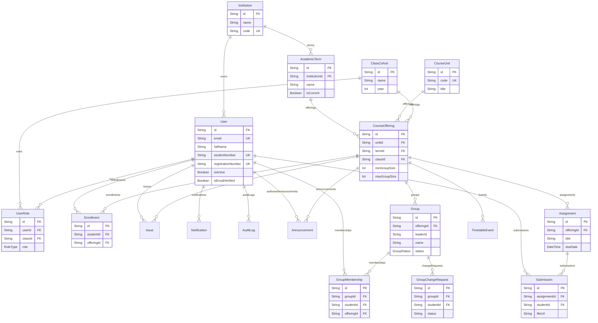

# Talora — Entity Relationship Diagram (ERD)

This document maps out the core data model of the Talora platform as defined in the Prisma schema.

## Core Schema (Mermaid)

## Cascade Behaviors
- **CourseOffering Deletion:** Cascades down to wipe all associated `Group`, `Enrollment`, `Assignment`, `Announcement`, `TimetableEvent`, and `Issue` records.
- **Group Deletion:** Cascades down to wipe `GroupMembership` and `GroupChangeRequest` records.
- **User Deletion:** Cascades down to wipe `Enrollment`, `GroupMembership`, `UserRole`, `Submission`, `Issue`, and `Notification` records. Note: `AuditLog` records referencing a deleted user will have the `userId` set to `NULL` (SetNull) to preserve historical integrity.
